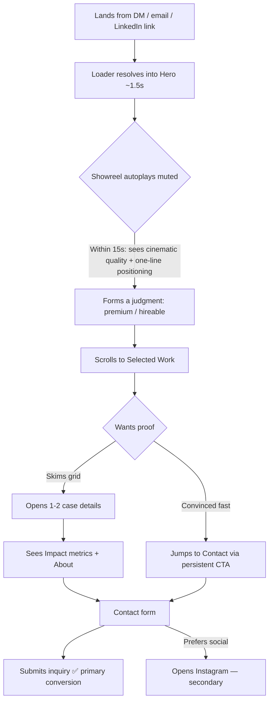

# Information Architecture — Rahul Jakhar Portfolio

> Companion to [`brief.md`](brief.md). Defines the structure, ordering, flow, and content hierarchy of the site — plus low-fidelity wireframes and the mobile adaptation strategy. Every decision is engineered around the brief's **15-second test** and the single primary conversion: an inbound contact from a hiring decision-maker.

---

## 1. Architectural model

**A single-page, scroll-driven narrative** with anchored navigation — not a multi-page site.

**Why single-page:** The primary visitor (a hiring Marketing Director) judges in seconds and arrives from a DM, email, or LinkedIn link. A single, uninterrupted scroll removes navigation friction, controls the story's pacing like a film edit, and guarantees the work is encountered immediately. Multi-page navigation would introduce decision points and load delays that work against the 15-second test.

**Future-proofing:** The architecture *reserves* additional routes (journal, media kit, expanded case studies) that are **not built in v1** but require no redesign to add later — they attach to the same shell, navigation, and design system. (See [`technical-architecture.md`](technical-architecture.md).)

---

## 2. Sitemap

```
rahuljakhar.com  (v1 — single page)
│
├─ /  (the one page; all sections are in-page anchors)
│   ├─ #hero            — showreel-first landing
│   ├─ #work            — selected work gallery
│   ├─ #impact          — audience metrics band
│   ├─ #services        — capabilities
│   ├─ #about           — story + portrait
│   ├─ #watch           — featured long-form (YouTube)
│   ├─ #trust           — worked-with + testimonials (modular)
│   └─ #contact         — form (primary CTA) + Instagram
│
├─ /resume   (PDF / one-pager — linked, not a designed page)
├─ /privacy  (lightweight legal page for form data)
└─ /og        (generated social-share image route)

RESERVED — future, not built in v1 (no redesign required to add):
├─ /work/[slug]   — full case-study pages
├─ /journal       — articles / insights (personal-brand platform)
├─ /journal/[slug]
├─ /media-kit     — downloadable brand/press kit
└─ /ar            — Arabic locale (i18n) of the above
```

---

## 3. Page hierarchy

Three structural tiers wrap the page so the experience is consistent and the future platform can attach cleanly.

```
APP SHELL  (persistent across all current + future routes)
├─ Loader — minimal first-paint bridge only (≤500ms, opacity-only, first visit); NO intro sequence (may be omitted)
├─ Header — minimal: wordmark (left) · anchor nav (right) · "Get in touch" (persistent)
├─ <main> — the scroll narrative (see §4)
└─ Footer — wordmark · socials · résumé link · legal · email

PAGE: Home
└─ 8 sequential sections (§4), each a self-contained "scene"

GLOBAL OVERLAYS (rendered above the page when triggered)
├─ Case-detail panel (opens from a work card)
├─ Mobile nav drawer
└─ Form success / error states
```

---

## 4. Section order — the scroll story

Order is a deliberate narrative arc: **Hook → Proof of craft → Proof of reach → What you get → Who he is → Depth → Trust → Act.** Each section earns the next scroll.

| # | Section | Anchor | Narrative job | Primary content | Conversion role |
|---|---------|--------|---------------|-----------------|-----------------|
| 0 | **Loader** | — | Minimal first-paint bridge (≤500ms, first visit) — bridges reel decode, **no intro spectacle**; may be omitted | Wordmark only | Perceived performance |
| 1 | **Hero (showreel-first)** | `#hero` | **Win the 15-second test** | Muted autoplay reel, one-line positioning, name/wordmark, **proof-line (e.g. "88K subs · 10M+ views")**, primary CTA, scroll cue | Instant credibility + the *why-hire* signal + first CTA |
| 2 | **Selected Work** | `#work` | Prove craft, repeatedly | Curated films in an editorial grid, category filter | Deepens belief; opens case details |
| 3 | **Impact band** | `#impact` | Prove distribution (quiet credibility) | 88K YT · 48K IG · impressions, framed as "audience built" | Differentiator; "he can grow our brand" |
| 4 | **Capabilities** | `#services` | Show what he'd bring **in a role** (not a freelance menu) | Role-framed capabilities ("what I'd bring to your brand"), **no pricing** | Maps him to an in-house role |
| 5 | **About** | `#about` | Humanize; build trust; **answer the relocation objection head-on** | Story (family RE → creator), portrait, "why Dubai/why luxury", **explicit availability/relocation line** ("relocating to Dubai · available [date] · open to relocation") | Personal connection + removes the #1 logistical doubt |
| 6 | **Featured long-form** | `#watch` | Prove range beyond short-form | Best YouTube piece (facade embed) | Reinforces reach + craft |
| 7 | **Worked-with + Testimonials** | `#trust` | Third-party validation (modular) | Logo wall + quotes — *hidden until provided* | Social proof |
| 8 | **Contact** | `#contact` | **Convert** | Form (name/company/email/message) + **LinkedIn (co-primary)** + Instagram | Primary conversion |
| — | **Footer** | — | Close + redundant paths | Wordmark, socials (**LinkedIn**, IG, YT), résumé, email, availability note | Safety-net CTA |

**Modularity:** Sections 3, 6, and 7 are content-gated (metrics, long-form pick, brands/testimonials from brief §15 Open Questions). Each is a self-contained block that can be hidden or populated without disturbing the surrounding flow.

---

## 5. User flows

### Primary flow — "The 15-Second Recruiter" (the one we optimize for)



**Design implication:** the persistent "Get in touch" affordance means **K is reachable from any point** — the recruiter who is convinced in 10 seconds never has to scroll to the bottom.

### Secondary flows
- **The Boutique Founder (deliberate):** reads About + Services carefully, watches long-form, checks testimonials → contact. *Needs depth available below the hook.*
- **The Top Agent (social):** arrives from Instagram, skims Reels/personal-branding work → returns to Instagram or contacts. *Needs the work filterable by type and the Instagram link prominent.*
- **The Forwarder:** a recruiter forwarding the link → relies on rich OG preview + résumé link. *Needs strong social-share metadata.*

---

## 6. Content hierarchy

Visual weight is allocated to match conversion value. Ranked, heaviest first:

1. **The work (video)** — largest, brightest, most motion. The footage is the argument.
2. **The one-line positioning + primary CTA** — the only large text in the hero.
3. **Audience metrics** — bold numerals, but contained to one band (credibility, not headline — per brief).
4. **Section titles** — confident, cinematic, sparse.
5. **Supporting copy** — short, editorial, never long paragraphs (brief Design Constraints).
6. **Navigation, captions, meta** — quiet, recessive.

**Per-section internal hierarchy rule:** each scene leads with *one* dominant element (a video, a number, a title), supported by at most one secondary element and one action. Nothing competes. This enforces the brief's "editorial restraint" and "no clutter."

---

## 7. Low-fidelity wireframes

ASCII, structure-only (no visual styling). Two viewports per key section: **desktop (≥1024px)** and **mobile (<768px)**.

### 7.1 Header (persistent)
```
DESKTOP
┌───────────────────────────────────────────────────────────────┐
│  RAHUL JAKHAR              Work  Impact  About        [Get in ▸]│
└───────────────────────────────────────────────────────────────┘
  ▲ wordmark (left)          ▲ anchor nav (center/right)  ▲ persistent CTA

MOBILE
┌───────────────────────────────┐
│  RAHUL JAKHAR            [☰]   │   ☰ opens nav drawer; CTA inside drawer
└───────────────────────────────┘
```

### 7.2 Hero — showreel-first (Section 1)
```
DESKTOP                                   MOBILE
┌───────────────────────────────────────┐ ┌───────────────────────────┐
│                                       │ │                           │
│        [ MUTED AUTOPLAY SHOWREEL ]    │ │   [ AUTOPLAY SHOWREEL ]   │
│        [ full-bleed, letterboxed  ]   │ │   [ portrait-safe crop ]  │
│                                       │ │                           │
│   Cinematic real estate content.      │ │  Cinematic real estate    │
│   Built for Dubai.                    │ │  content. Built for Dubai.│
│                                       │ │                           │
│   [ Get in touch ▸ ]   ⌄ scroll       │ │  [ Get in touch ▸ ]       │
│                            🔊 unmute   │ │  ⌄ scroll      🔊 unmute  │
└───────────────────────────────────────┘ └───────────────────────────┘
  Dominant: video. One line of copy. One CTA. One scroll cue.
```

### 7.3 Selected Work (Section 2)
```
DESKTOP — editorial, asymmetric grid (not uniform cards)
┌───────────────────────────────────────────────────────────────┐
│  Selected Work        [All][Property][Lifestyle][Reels][YT]    │
│                                                                 │
│  ┌─────────────────────────┐   ┌───────────────┐               │
│  │   ▷ film 01 (large)     │   │  ▷ film 02    │               │
│  │   hover → preview plays │   │               │               │
│  └─────────────────────────┘   └───────────────┘               │
│         ┌───────────────┐   ┌─────────────────────────┐         │
│         │  ▷ film 03    │   │   ▷ film 04 (large)     │         │
│         └───────────────┘   └─────────────────────────┘         │
│  Title · Category appear on hover; click → case-detail panel    │
└───────────────────────────────────────────────────────────────┘

MOBILE — single column, tap to open; filter scrolls horizontally
┌───────────────────────────┐
│ Selected Work             │
│ [All][Property][Reels]→    │
│ ┌───────────────────────┐ │
│ │   ▷ film 01           │ │
│ │   title · category    │ │
│ └───────────────────────┘ │
│ ┌───────────────────────┐ │
│ │   ▷ film 02           │ │
│ └───────────────────────┘ │
└───────────────────────────┘
```

### 7.4 Case-detail panel (overlay from a work card)
```
DESKTOP — opens in place / slide-over, dims the page
┌───────────────────────────────────────────────────────────────┐
│ ✕                                                               │
│  ┌───────────────────────────────────────────────────────┐     │
│  │            [ FILM PLAYER — adaptive stream ]           │     │
│  └───────────────────────────────────────────────────────┘     │
│  Project title                                                  │
│  Role · Brief · Approach   (3 short lines, no long paragraphs)  │
│  ‹ prev          next ›                                         │
└───────────────────────────────────────────────────────────────┘
MOBILE — full-screen takeover, swipe down to close, swipe ‹›
```

### 7.5 Impact band (Section 3)
```
DESKTOP
┌───────────────────────────────────────────────────────────────┐
│        88K              48K              10M+                   │
│     YouTube          Instagram        Impressions              │
│     subscribers      followers        (cumulative)             │
│        "An audience built from zero — proof content converts."  │
└───────────────────────────────────────────────────────────────┘
MOBILE — stacked, numbers count up on scroll-into-view
┌───────────────────────────┐
│   88K  YouTube            │
│   48K  Instagram          │
│   10M+ Impressions        │
└───────────────────────────┘
```

### 7.6 Services (Section 4)
```
DESKTOP — list/editorial, NOT skill bars (brief constraint)
┌───────────────────────────────────────────────────────────────┐
│  What I do                                                      │
│  01  Cinematic property films      ──────────────              │
│  02  Personal-branding content     ──────────────              │
│  03  Short-form / Reels            ──────────────              │
│  04  YouTube & long-form           ──────────────              │
│  05  Content strategy              ──────────────              │
│  (hover reveals a one-line value statement per item)           │
└───────────────────────────────────────────────────────────────┘
MOBILE — accordion list; tap row to reveal the one-liner
```

### 7.7 About (Section 5)
```
DESKTOP — portrait + sparse editorial copy
┌───────────────────────────────────────────────────────────────┐
│  ┌─────────────┐   From real estate floors to the lens.        │
│  │  PORTRAIT   │   Short, human story (3–4 short lines).        │
│  │   (photo)   │   Why Dubai. Why luxury.                       │
│  └─────────────┘   [ Download résumé ▸ ]                        │
└───────────────────────────────────────────────────────────────┘
MOBILE — portrait on top, copy below, CTA below
```

### 7.8 Featured long-form (Section 6)
```
DESKTOP                                   MOBILE
┌───────────────────────────────────────┐ ┌───────────────────────────┐
│  Watch                                │ │  Watch                    │
│  ┌─────────────────────────────────┐  │ │ ┌───────────────────────┐ │
│  │  [ YouTube facade → click play ]│  │ │ │ [ YT facade ]         │ │
│  └─────────────────────────────────┘  │ │ └───────────────────────┘ │
│  Title · why this piece (one line)    │ │  Title · one line         │
└───────────────────────────────────────┘ └───────────────────────────┘
```

### 7.9 Worked-with + Testimonials (Section 7 — modular)
```
DESKTOP — logo wall + quote(s); hidden entirely until content exists
┌───────────────────────────────────────────────────────────────┐
│   [logo] [logo] [logo] [logo] [logo] [logo]                    │
│   "Quote from a collaborator."  — Name, Role                    │
└───────────────────────────────────────────────────────────────┘
```

### 7.10 Contact (Section 8) + Footer
```
DESKTOP
┌───────────────────────────────────────────────────────────────┐
│  Let's build something cinematic.                               │
│  ┌─────────────────────┐   Name      [________________]         │
│  │ (short invitation)  │   Company   [________________]         │
│  │                     │   Email     [________________]         │
│  │  or DM on Instagram │   Message   [________________]         │
│  │  @realtybyrahul ▸   │             [ Send inquiry ▸ ]         │
│  └─────────────────────┘                                        │
├───────────────────────────────────────────────────────────────┤
│  RAHUL JAKHAR     IG · YT · Email · Résumé        © / Privacy   │
└───────────────────────────────────────────────────────────────┘
MOBILE — invitation, then stacked form fields, then Instagram, then footer
```

---

## 8. Mobile adaptation strategy

Mobile is **not** a fallback — the brief states most first opens come from a phone via DM/WhatsApp. Mobile is a first-class target.

### Breakpoints
| Token | Range | Layout intent |
|-------|-------|---------------|
| `sm` | < 768px | Single column, stacked, full-bleed media, drawer nav |
| `md` | 768–1023px | Two-column where it helps (About, Contact); simplified grid |
| `lg` | ≥ 1024px | Full editorial asymmetric grid, full motion (native cursor — no custom cursor) |

### Reordering & layout
- All sections keep the **same order** on mobile (the narrative arc is intentional); only internal layouts collapse to single column.
- Work grid → single column, tap-to-open; the asymmetric desktop grid becomes a rhythmic vertical sequence (varying heights retain editorial feel).
- Case detail → full-screen takeover with swipe-to-close and swipe between pieces.
- Nav → hamburger drawer; the **persistent "Get in touch"** lives both in the drawer and as the hero/contact CTA so it's always one tap away.

### Video & data behavior (critical)
- Hero uses a **portrait-safe crop / mobile-encoded variant** of the showreel, not a letterboxed desktop crop.
- **Autoplay muted** only when the connection allows; honor the browser's data-saver and `prefers-reduced-data` → show a **poster frame with a tap-to-play** button instead of autoplaying.
- Adaptive bitrate (ABR) streaming ensures the reel starts fast on cellular; poster frames render instantly.
- Below-the-fold videos lazy-load and never autoplay on mobile.

### Touch & ergonomics
- Minimum **44×44px** touch targets; primary CTA thumb-reachable.
- Hover-only affordances (work-card preview, service one-liners) get **tap/expand equivalents** — no information is hover-locked.
- Horizontal scroll only for the category filter chips (a deliberate, signposted pattern), never for content.

### Motion on mobile
- Reduce scroll-pinning and parallax intensity (battery/jank); keep entrance reveals and metric count-ups.
- **`prefers-reduced-motion`** fully honored: replace all transforms with instant/opacity-only states (see [`interaction-and-motion.md`](interaction-and-motion.md)).

---

## 9. How this serves the brief

- **15-second test:** Hero is showreel-first; the persistent CTA makes conversion reachable instantly.
- **Hiring conversion over novelty:** ordering is a proof funnel (craft → reach → fit → trust → act), not a gallery.
- **Editorial restraint / no clutter:** one dominant element per scene; modular hiding of empty sections.
- **Future-proofing:** reserved routes + app shell absorb the personal-brand platform without redesign.
- **Mobile-first:** mobile treated as the primary surface, with explicit data/motion safeguards.

---

*Next: [`creative-direction.md`](creative-direction.md) defines the visual and emotional language that dresses this structure.*
