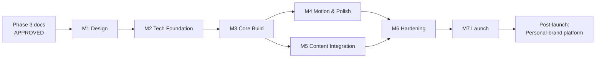

# Development Roadmap — Rahul Jakhar Portfolio

> Companion to all Phase 3 docs. Sequences the project into logical milestones with **deliverables, dependencies, exit criteria, and required inputs**. Phases are gated: implementation does not begin until the Phase 3 documents are approved.
>
> No fixed calendar dates are assigned (the brief states no hard deadline); milestones are ordered by dependency. Effort sizes are relative (S/M/L).

---

## Critical path at a glance

**Three things gate the whole timeline (from brief §15 Open Questions):**
1. **Rahul's assets** (showreel master + curated work + portrait) → gate **M5**.
2. **Managed-video account, domain, form-destination email** → gate **M7**.
3. **Exact analytics, brands/testimonials** → populate modular slots, can land any time before M7.

---

## M0 — Strategy & Creative Direction  ✅ (this phase)
**Deliverables:** [`brief.md`](brief.md), [`information-architecture.md`](information-architecture.md), [`creative-direction.md`](creative-direction.md), [`design-system.md`](design-system.md), [`technical-architecture.md`](technical-architecture.md), [`roadmap.md`](roadmap.md), [`interaction-and-motion.md`](interaction-and-motion.md).
**Exit criteria:** all documents approved.
**Dependency:** none.

---

## M1 — Design  *(L)*
Turn the approved direction into pixel-level design.

**Deliverables**
- **Logotype / wordmark** for "Rahul Jakhar / Realty by Rahul" + monogram (RJ) — the one brand asset the brief flags as missing.
- **Low→high-fidelity designs** of all sections (desktop + mobile) realizing Direction A in the design-system tokens.
- **Design-token file** finalized (color, type, space, grid) — the contract handed to M2.
- **Motion/interaction reference** (key states + a couple of motion studies) aligned with [`interaction-and-motion.md`](interaction-and-motion.md).
- **Asset spec sheet** — exact aspect ratios, durations, resolutions, and counts Rahul needs to supply (drives M5).

**Dependencies:** M0 approved.
**Exit criteria:** high-fidelity designs + tokens + logotype approved; asset spec sheet delivered to Rahul.
**Required input:** none blocking (uses placeholder media); Rahul's asset delivery can begin in parallel against the spec sheet.

---

## M2 — Technical Foundation  *(M)*
Stand up the project skeleton and confirm the deferred tool choices.

**Deliverables**
- **Finalize Part B tool choices** ([`technical-architecture.md`](technical-architecture.md)) against the current landscape; record decisions.
- Repository, framework scaffold, **design tokens implemented in code**, base styling layer.
- **Typed content model** + modular content slots (work, services, about, metrics, trust).
- Vendor seams stubbed (video, email, analytics, CMS-later) behind internal interfaces.
- CI + **preview-deploy pipeline** to the edge host; HTTPS; environment config.
- Performance budget wired into CI (Lighthouse/CWV check).

**Dependencies:** M1 tokens.
**Exit criteria:** an empty-but-deployable shell with tokens, content model, and preview deploys live; budget check green.

---

## M3 — Core Build  *(L)*
Build the static experience with placeholder media — structure and content, no heavy motion yet.

**Deliverables**
- App shell: `Header`, `NavAnchors`/`NavDrawer`, `PersistentCTA`, `Footer`, `Loader` (static).
- All sections from the IA built and responsive: `Hero`, `WorkGallery`+`WorkCard`, `CaseDetail`, `ImpactBand`, `Services`, `About`, `FeaturedVideo`, `TrustWall` (modular/hidden), `ContactSection`.
- `ContactForm` wired to the serverless function (test inbox) with validation + success/error states.
- Mobile layouts per the IA mobile strategy.

**Dependencies:** M2.
**Exit criteria:** full page navigable on desktop + mobile with placeholder assets; form submits to a test inbox; all components match the design system (pre-motion).

---

## M4 — Motion & Polish  *(M)*
Layer the cinematic behavior per [`interaction-and-motion.md`](interaction-and-motion.md).

**Deliverables**
- Loader→hero reveal; scroll choreography (hero→work cut, section reveals, pinning where specced).
- Work-card hover previews; case-detail open/close; category filter transitions.
- Metric count-ups; micro-interactions (hover/focus, button fills, scroll cue). *(No custom cursor — removed.)*
- Smooth-scroll integration.
- **`prefers-reduced-motion` and `prefers-reduced-data` variants** for every animation.

**Dependencies:** M3.
**Exit criteria:** motion matches the animation timeline; reduced-motion path verified; no jank against the performance budget on a mid-tier mobile device.

---

## M5 — Content Integration  *(M)*  ⟵ gated by Rahul's assets
Replace placeholders with real, graded work.

**Deliverables**
- Showreel + curated films uploaded to the managed-video service (posters generated, ABR verified).
- Final **copy** (all sections, written by us per brief) reviewed by Rahul.
- Real **metrics** in the Impact band; **portrait** + About story; **featured long-form** chosen.
- Modular slots populated as available: **brands/worked-with**, **testimonials**, **résumé/one-pager** link.
- Film grade/LUT applied consistently across media.

**Dependencies:** M3 (slots exist), Rahul's assets (brief §15), M1 asset spec sheet.
**Exit criteria:** real content live in staging; curation finalized (quality-over-quantity per brief); no placeholder media remains.
**Required input from Rahul:** showreel master, curated work files/links, portrait, exact analytics, optional brands/testimonials/résumé.

---

## M6 — Hardening  *(M)*
Make it fast, found, and accessible.

**Deliverables**
- Performance pass to meet the budget (LCP/CLS/INP, JS budget, font subsetting, lazy-load audit).
- SEO: metadata, Open Graph + **dynamic OG image**, `Person`/`CreativeWork`/`VideoObject` structured data, sitemap/robots.
- Accessibility audit: keyboard nav, focus states, captions/controls, contrast, reduced-motion/data.
- Cross-device/browser QA (incl. real mid-tier Android on cellular — the brief's primary surface).
- Privacy analytics + engagement events wired (reel watch-through, scroll depth, form conversion).

**Dependencies:** M4 + M5.
**Exit criteria:** Lighthouse ≥ 90 across the board; a11y checklist passed; analytics verified; QA sign-off.

---

## M7 — Launch  *(S)*
Ship.

**Deliverables**
- Production domain + DNS + HTTPS; form-destination email verified end-to-end; spam protection live.
- Final content + legal/privacy page; 404/og routes; favicon/app icons.
- Production analytics live; smoke test of the primary flow (land → watch → contact).
- Handover doc: how to update content/metrics/work (and the CMS-migration note for later).

**Dependencies:** M6; **domain + form email + video account** (brief §15).
**Exit criteria:** site live on the production domain; primary conversion path verified in production; Rahul can share the single link.

---

## M8 — Post-launch: Personal-brand platform  *(future, additive)*
Evolve without redesign (brief future-proofing).

**Candidate increments (each independent, additive):**
- **Journal / Insights** (`/journal`) — introduce headless CMS behind the existing content seam.
- **Media kit** (`/media-kit`) — downloadable press/brand kit.
- **Full case-study pages** (`/work/[slug]`).
- **Arabic / RTL locale** (`/ar`).
- Iteration on conversion based on analytics (what employers actually engage with).

**Dependencies:** M7 live; CMS introduced when non-coder editing is needed.

---

## Dependency matrix

| Milestone | Depends on | External input required | Blocks |
|-----------|-----------|--------------------------|--------|
| M1 Design | M0 approved | — (asset spec produced here) | M2 |
| M2 Foundation | M1 tokens | tool finalization | M3 |
| M3 Core Build | M2 | — (placeholders) | M4, M5 |
| M4 Motion | M3 | — | M6 |
| M5 Content | M3 + spec sheet | **Rahul's assets** | M6 |
| M6 Hardening | M4 + M5 | analytics keys | M7 |
| M7 Launch | M6 | **domain, form email, video acct** | M8 |
| M8 Platform | M7 | (per increment) | — |

---

## Risk-aware sequencing notes

- **M4 and M5 run in parallel** off M3 (motion needs no real assets; content needs no motion), compressing the critical path.
- **Asset delivery is the likeliest bottleneck** (brief R1/R4). The M1 asset spec sheet exists precisely to start Rahul's collection early and in the right formats.
- **Curate during M5, not after** — the brief mandates ruthless curation; M5's exit criterion enforces quality-over-quantity.
- **Performance is verified continuously** (budget in CI from M2), not deferred to M6, so heavy video never silently regresses the 15-second test.

---

*Next: [`interaction-and-motion.md`](interaction-and-motion.md) — the behavioral and motion blueprint that M3–M4 implement.*
