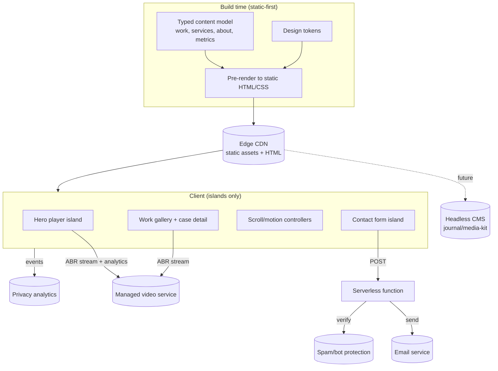

# Technical Architecture — Rahul Jakhar Portfolio

> Companion to [`brief.md`](brief.md) and [`design-system.md`](design-system.md).
>
> **Structured per the project's technology-agnostic principle.** Part A defines the **durable architecture and required capabilities** — the decisions that should hold regardless of which library wins. Part B lists **recommended implementations to finalize immediately before implementation**, with trade-offs and decision criteria. Nothing in Part B is locked now; tools are chosen against the then-current landscape unless an architectural reason compels an earlier commitment.

---

## Part A — Architecture & capabilities (the durable decisions)

### A1. Rendering model

**Static-first, pre-rendered content with selective (island) interactivity.**

- The site is **content that rarely changes** (a single marketing page) wrapped in **rich but localized interactivity** (video, scroll motion, a form). The correct model is therefore **pre-render everything to static HTML/CSS at build time**, then **hydrate only the interactive islands** (hero player, work gallery, form, motion controllers).
- **Why (tied to brief):** the performance NFR (fast first paint despite heavy video, strong mobile Core Web Vitals) and the 15-second test demand that meaningful content paints instantly without waiting on a large client bundle. Server-rendered/streamed dynamic pages would add cost with no benefit for static content; a fully client-rendered SPA would harm first paint and SEO.
- **Implication:** ship the **minimum JavaScript** needed for the islands; everything else is HTML/CSS. Code-split per island.

### A2. Required capabilities

Each capability is a hard requirement traced to the brief. The implementation must satisfy all of them.

| # | Capability | Requirement | Brief tie-in |
|---|-----------|-------------|--------------|
| C1 | **Component-based UI, bespoke** | Reusable, custom components (no template/UI-kit look) | Avoid generic patterns; design-system component philosophy |
| C2 | **Performant video delivery** | Fast-start, poster-bridged, appropriately optimized video meeting the A5 budget; adaptive delivery where the asset set/networks warrant it. Vendor-agnostic (see B4) | Performance; success metrics; R2 |
| C3 | **Responsive image optimization** | AVIF/WebP, responsive `srcset`, lazy-load, zero-CLS | Performance NFR |
| C4 | **Motion capability** | Scroll choreography + smooth scroll + UI-state transitions, all honoring `prefers-reduced-motion` | Cinematic direction; accessibility |
| C5 | **Design-token-driven styling** | Tokens (color/type/space) as single source; sharp, custom system | Design system; maintainability |
| C6 | **Structured content model** | Typed content separated from presentation; modular slots for hidden-until-provided sections; clean path to non-coder CMS later | Maintainability; modularity; future platform |
| C7 | **SEO & social sharing** | Metadata, Open Graph + dynamic OG image, Person/CreativeWork structured data, sitemap, semantic HTML | Feature #18; "link travels via DMs" |
| C8 | **Serverless form handling** | Reliable email delivery + spam protection, validation, success/error states | Primary CTA; features #7/#20 |
| C9 | **Privacy-respecting analytics** | Lightweight, consent-appropriate, engagement events (reel plays, scroll depth, form submit) | Success metrics; privacy NFR |
| C10 | **Edge-CDN hosting + previews** | Global CDN, HTTPS, preview deploys, image optimization, high uptime | Performance; reliability; MENA latency |
| C11 | **Accessibility** | Keyboard nav, focus states, captions/controls, contrast, reduced-motion/reduced-data | Accessibility NFR |
| C12 | **Internationalization-ready** | Structure that can add Arabic/RTL without redesign (not built in v1) | Future-proofing; MENA |

### A3. Architectural principles

1. **Separation of content from presentation** — content lives in a typed model (C6); components render it. This is what makes the CMS migration and the modular sections painless.
2. **Progressive enhancement** — core content and the contact path work without JS; motion and video enhance on top. The form degrades to a working POST.
3. **Performance budget as a gate** — an explicit budget (below) is a release criterion, not an aspiration. Heavy video is isolated behind streaming + posters so it never blocks first paint.
4. **Additive extensibility** — the app shell + routing + design system absorb future routes (journal, media kit, `/work/[slug]`, `/ar`) without a rewrite. v1 builds the shell to that contract even though those routes ship empty/reserved.
5. **Vendor-replaceable seams** — video, email, analytics, and CMS sit behind thin internal interfaces so any single provider can be swapped without touching components (de-risks the Part B choices).

### A4. High-level architecture

### A5. Performance budget (release gate)

| Metric | Target (mobile, mid-tier device, 4G) |
|--------|--------------------------------------|
| LCP | < 2.5s (poster frame, not the video stream, is the LCP element) |
| CLS | < 0.05 (enforced aspect-ratios + poster frames) |
| INP | < 200ms |
| Initial JS (compressed) | ≤ ~120KB for first paint; islands lazy-loaded |
| Hero reel start | < 2s to first frame on 4G (ABR + poster bridge) |
| Lighthouse (Perf/Best-Practices/SEO/A11y) | ≥ 90 each |

**Guardrails:** fonts subset + `font-display: swap`; below-fold media lazy-loaded; no autoplay under `prefers-reduced-data`; animation libraries loaded only where used; third-party scripts minimized (facade YouTube embed, no heavy chat widgets).

**⚠ Budget vs. motion tension (resolve at M2/M4):** the 120KB target and a full motion stack (framework hydration + GSAP + smooth-scroll + a React-transition lib + video player) are in tension. Cut-list, in order: prefer **CSS + IntersectionObserver** reveals over JS libs wherever they suffice; drop the React-transition lib if GSAP (or CSS) covers UI transitions; add GSAP/ScrollTrigger only on the island that needs it and code-split it; use a minimal/native video player. The budget is the gate — the motion stack flexes to meet it, not the reverse.

---

## Part B — Recommended implementations (finalize immediately before implementation)

> These are **recommendations with decision criteria**, not commitments. Confirm versions/landscape at implementation start (M2). Each maps to a capability in A2 and sits behind a replaceable seam (A3.5).

### B1. Component framework + rendering — *recommended: Next.js (App Router) · valid alternative: Astro*
- **Why a React-based static-first framework:** satisfies C1/A1, has the deepest ecosystem for the motion + video islands, first-class image optimization (C3), built-in metadata/OG/sitemap (C7), and serverless functions for the form (C8) in one toolchain.
- **Recommendation: Next.js (App Router), used in a static-first posture** (prerender content, hydrate only the interactive islands per A1). It is the most future-proof path for the personal-brand platform (journal, media kit, possibly auth/courses) with no framework migration, has the richest ecosystem for the motion/video work, and pairs cleanly with the form's serverless functions and image optimization in one toolchain. RSC + Partial Prerendering bring it close to static performance for content; the residual JS gap vs. Astro is closed by discipline (A5 budget + the cut-list).
- **Valid alternative — Astro (the honest trade-off):** Astro ships the least JS by default (native islands) → the best *raw* performance for a mostly-static page, and adding `/journal` or `/media-kit` later is not a redesign in Astro either. **Astro is the better choice if** the site is certain to remain a single marketing page with minimal interactivity and absolute-minimum JS is the dominant priority. We choose Next.js intentionally — for the platform growth path and ecosystem — not dogmatically; the decision is revisitable if scope narrows.
- **Decision criteria:** committed platform features + React ecosystem → Next.js; guaranteed single static page + minimum-JS priority → Astro. Either way the rendering model (A1) and token system are identical, so the choice is contained.

### B2. Styling — *recommend: utility CSS + CSS-variable tokens (e.g. Tailwind v4) · alternative: CSS Modules*
- Satisfies C5. Utility CSS with a token layer gives speed, consistency, tiny production CSS, and a single source of truth that maps directly to [`design-system.md`](design-system.md). Components stay **custom** (no UI kit) so nothing reads as a template.
- **Alternative:** CSS Modules / vanilla-extract if the team prefers scoped CSS over utilities. Either way, **design tokens as CSS variables** is the durable decision; the authoring style is the swappable part.

### B3. Motion — *recommend: GSAP + ScrollTrigger · smooth-scroll lib (e.g. Lenis) · React-transition lib (e.g. Motion/Framer Motion)*
- Satisfies C4. **CSS + IntersectionObserver first** for the now-reduced motion set (section reveals, count-ups, state transitions) — no JS animation library required for v1's baseline. A smooth-scroll library may be added for the premium feel; GSAP+ScrollTrigger is held in reserve **only if** a specific cinematic scroll device is later reintroduced.
- **Discipline:** motion is loaded only on islands that use it; **every animation has a `prefers-reduced-motion` fallback** (instant/opacity-only). See [`interaction-and-motion.md`](interaction-and-motion.md).
- **Decision criteria:** start with zero motion libs (CSS/IO); add a smooth-scroll lib if warranted; escalate to GSAP only for a justified cinematic device — not by default.

### B4. Video — *implementation-agnostic; decision deferred until actually needed*
- Satisfies C2. **No video platform is committed at this stage.** The requirement is a *capability* — fast-starting, poster-bridged, appropriately optimized video that meets the A5 performance budget and the UX — not a specific vendor. The showreel/films sit behind a thin `Video` seam (A3.5) so the backing implementation can change without touching components.
- **Choose the simplest option that satisfies perf + UX + scale, at the moment it's needed.** Trade-offs to weigh then:

  | Option | Pros | Cons | Best when |
  |--------|------|------|-----------|
  | **Static self-hosted** (optimized MP4/WebM + poster, served from CDN) | Zero extra service, cheapest, simplest, full control | No adaptive bitrate; larger files; manual encoding; weaker on poor networks | Few short clips, strong CDN, tight budget, simplicity prioritized |
  | **Static HLS** (pre-segmented, self-hosted) | Adaptive bitrate without a SaaS; CDN-served | Manual encoding/segmenting pipeline; more build complexity | Want ABR but avoid per-minute SaaS cost |
  | **Cloudflare Stream** | Managed ABR, cheap per-VOD, simple API, pairs with CF hosting | 1080p cap; limited per-title analytics | Managed ABR at low cost is the priority |
  | **Mux** | Best-in-class ABR, JIT encode, per-title QoE analytics | Highest cost; analytics likely surplus for a hiring site | Edit iteration is genuinely driven by per-title engagement data |

  **Default leaning (not a commitment):** start with the **simplest** approach that clears the budget for the actual asset set (likely static self-hosted or static HLS for a small, curated reel set), and escalate to a managed service (Cloudflare Stream → Mux) only if the asset count, network targets, or analytics needs demand it. Decide during M5 against the real assets.
- Long-form lives on **YouTube** (his channel is the proof) via a **facade embed** (no heavy iframe until clicked).

### B5. SEO — *Next Metadata API (or framework equivalent) + dynamic OG image + structured data*
- Satisfies C7. Per-page metadata, Open Graph/Twitter cards, a **dynamically generated OG image** (the link will travel through DMs/email — the preview is the first impression), `Person` + `CreativeWork`/`VideoObject` JSON-LD, `sitemap.xml`/`robots.txt`, semantic HTML.

### B6. Content strategy — *recommend: typed local content for v1 → headless CMS at platform stage (e.g. Sanity)*
- Satisfies C6. **v1:** content (work items, services, metrics, about) lives in **typed local files (TS/MDX)** — fast, free, versioned in git, zero runtime cost, and trivially edited by the build team as Rahul's assets arrive. Modular slots let hidden-until-provided sections (brands, testimonials) drop in without refactors.
- **Migration path:** when the **journal / media kit** launches (and Rahul needs non-coder editing), introduce a **headless CMS (e.g. Sanity)** behind the same content interface — components don't change. This is the additive-extensibility principle (A3.4) in action.
- **Decision criteria:** if non-coder editing is needed at launch, start with the CMS directly; the seam (A3.5) makes either entry point valid.

### B7. Forms & infrastructure — *serverless function + email service (e.g. Resend) + bot protection (e.g. Turnstile + honeypot)*
- Satisfies C8. The form POSTs to a serverless function that validates, checks a bot token + honeypot, and sends via a transactional email service to Rahul's inbox; returns success/error states to the UI. Progressive-enhancement fallback ensures it works without JS.

### B8. Analytics — *recommend: privacy-respecting analytics (e.g. Vercel Analytics or Plausible)*
- Satisfies C9. Cookieless/consent-light, lightweight. Track the brief's leading indicators: reel play rate + watch-through (via B4's video analytics), scroll depth, section reach, form conversion, Instagram referrals.

### B9. Deployment — *recommend: edge platform native to the chosen framework (e.g. Vercel) · alternative: Cloudflare/Netlify*
- Satisfies C10. Global edge CDN, automatic HTTPS, **preview deploys per branch**, image optimization, serverless functions colocated. If Next.js (B1) is chosen, Vercel is the lowest-friction host; Cloudflare Pages/Netlify are valid alternatives (and Cloudflare pairs naturally if Stream is chosen in B4).

### B-summary — capability → recommended tool map

| Capability | Recommended (confirm at M2) | Alternative |
|-----------|------------------------------|-------------|
| Framework/render (C1/A1) | **Next.js** (App Router, static-first) | Astro (if guaranteed single static page) |
| Styling (C5) | Tailwind v4 + CSS-var tokens | CSS Modules / vanilla-extract |
| Motion (C4) | GSAP + ScrollTrigger + Lenis + Motion | Motion-only (if light) |
| Video (C2) | **Deferred / agnostic** — simplest that meets budget (static → CF Stream → Mux) | decided at M5 vs. real assets |
| Images (C3) | Framework image pipeline (next/image) | Cloudinary / imgix |
| SEO (C7) | Framework metadata + dynamic OG + JSON-LD | — |
| Content (C6) | Typed local (TS/MDX) → Sanity later | Sanity from day one |
| Forms (C8) | Serverless fn + Resend + Turnstile | Formspree / native provider forms |
| Analytics (C9) | Vercel Analytics / Plausible | Fathom |
| Hosting (C10) | **Vercel** (pairs with Next.js) | Cloudflare Pages / Netlify |

---

## Decision log (what's locked vs. open)

- **Locked (architectural):** static-first/island rendering; performant poster-bridged video behind a vendor-agnostic seam; token-driven bespoke components; separated content model with modular slots; reduced-motion/reduced-data discipline; performance budget as a gate; replaceable vendor seams; extensible shell for the future platform.
- **Recommended (build on these now):** **Next.js (App Router, static-first)**, Tailwind v4 + CSS-var tokens, CSS/IO-first motion (escalate to GSAP only where needed), Vercel host, typed-local content.
- **Deferred (decide when needed):** video implementation (B4, at M5 vs. real assets), CMS timing, exact analytics/email/bot vendors.

---

*Next: [`roadmap.md`](roadmap.md) sequences the build; [`interaction-and-motion.md`](interaction-and-motion.md) specifies behavior and motion.*
